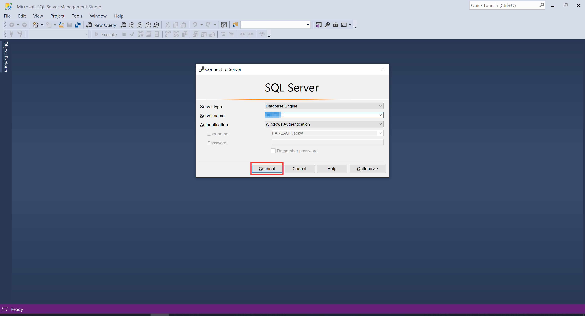
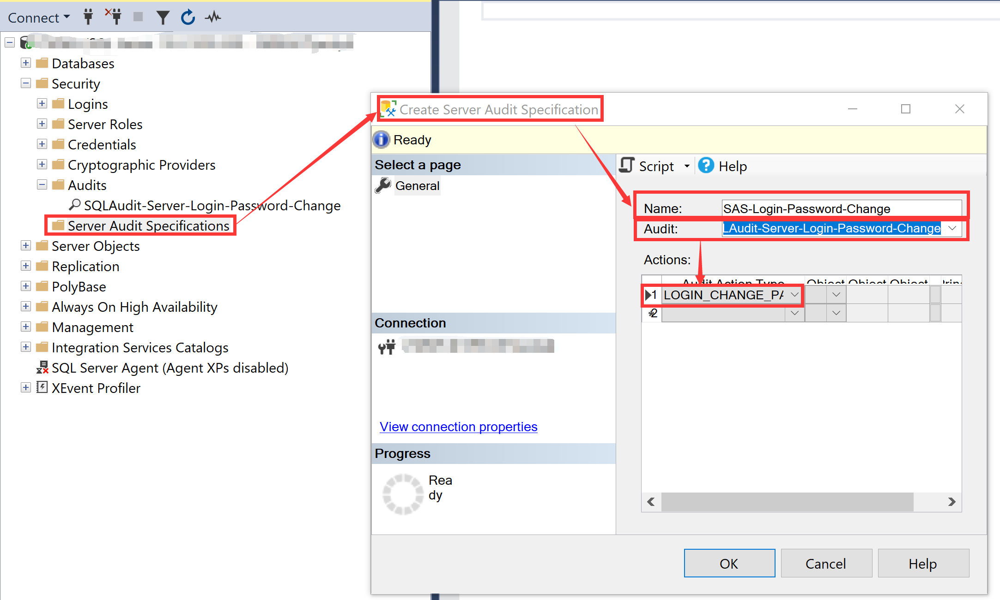

# SQL Server Feature - Audit - Login Password Change
## 1. Reference Official Documents
- CREATE SERVER AUDIT (Transact-SQL)<br/>
[CREATE SERVER AUDIT (Transact-SQL)](https://docs.microsoft.com/en-us/sql/t-sql/statements/create-server-audit-transact-sql?view=sql-server-2017)
- CREATE SERVER AUDIT SPECIFICATION (Transact-SQL)<br/>
[CREATE SERVER AUDIT SPECIFICATION (Transact-SQL)](https://docs.microsoft.com/en-us/sql/t-sql/statements/create-server-audit-specification-transact-sql?view=sql-server-2017)
- Audit Login Change Password Event Class<br/>
[Audit Login Change Password Event Class](https://docs.microsoft.com/en-us/sql/relational-databases/event-classes/audit-login-change-password-event-class?view=sql-server-2017)
- sys.fn_get_audit_file (Transact-SQL)<br/>
[sys.fn_get_audit_file (Transact-SQL)](https://docs.microsoft.com/en-us/sql/relational-databases/system-functions/sys-fn-get-audit-file-transact-sql?view=sql-server-2017)

## 2. Step by Step
### 2.0.1 Open SQL Server Management Studio

### 2.0.2 Login Instance

### 2.1 Create Server Audit - File Storage
```sql
USE [master]
GO

CREATE SERVER AUDIT [SQLAudit-Server-Login-Password-Change]
TO FILE 
(	FILEPATH = N'D:\'
	,MAXSIZE = 0 MB
	,MAX_ROLLOVER_FILES = 2147483647
	,RESERVE_DISK_SPACE = OFF
)
WITH
(	QUEUE_DELAY = 1000
	,ON_FAILURE = CONTINUE -- ON_FAILURE = { CONTINUE | SHUTDOWN | FAIL_OPERATION}
)
GO
```

### 2.2 Enable Server Audit
```sql
USE [master]
GO

ALTER SERVER AUDIT [SQLAudit-Server-Login-Password-Change]
WITH (STATE = ON); 
GO
```

### 2.3 Create Server Audit Specification
```sql
USE [master]
GO

CREATE SERVER AUDIT SPECIFICATION [SAS-Login-Password-Change]
FOR SERVER AUDIT [SQLAudit-Server-Login-Password-Change]
ADD (LOGIN_CHANGE_PASSWORD_GROUP)
GO
```

### 2.4 Enable Server Audit Specification
```sql
USE [master]
GO

ALTER SERVER AUDIT SPECIFICATION [SAS-Login-Password-Change]
WITH (STATE = ON)
GO
```

### 2.5 Test
```sql
-- Session A
USE [master]
GO
ALTER LOGIN [sa] WITH PASSWORD=N'NewP@ssWord!$'
GO

ALTER LOGIN [sa] WITH PASSWORD=N'NewP@ssWord!%'
GO

-- Session B
USE [master]
GO
ALTER LOGIN [sa] WITH PASSWORD=N'NewP@ssWord!@'
GO

ALTER LOGIN [sa] WITH PASSWORD=N'NewP@ssWord!#'
GO
```

### 2.6 Show Audit Records
```sql
USE master
GO

SELECT * FROM sys.fn_get_audit_file ('D:\SQLSA\SQLAudit-Server-Login-Password-Change_5B18EE40-F5F3-4411-BB05-627F77DAAFD1_0_132048830804510000.sqlaudit',default,default);  
GO
```
